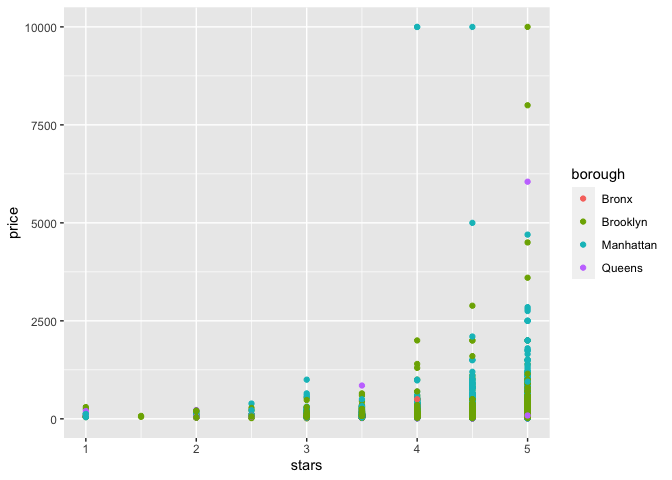

linear_models_1
================
Caleigh Dwyer
2023-11-09

lecture notes

\##linear models

Observe data for subjects 1 to n. Want to estimate the coefficients in
the model.

y = b0 (the y intercept) + B1x1 (b1 is the effect of the predictor on
the relationship between x and y)

Assumptinos: residuals have mean zero, constant variance, and are
independent

estimate parameters using OLS

Outcome is continuous, predictors can be anything. Continuous predictors
are added directly

categorical predictors require “dummy” or indicator variable -For each
non-reference group, a binary 0/1 variable indicating group membership
for each subject is created and used in the model

B1 = (B0 + B1 + B2) - (B0 + B2) = E(y\| age = 1, sex = male) - E(y\|age
= 0, sex = male) \[E is the expected value\] expected change in y for a
one unit cahnge in age, keeping sex fixed

\##Testing

For a single regression coefficient, you can construct a test statistic:

t = (B -b)/se(B)

for large samples, the test statistic has a standard normal distribution

to test multiple coefficients (i.e. categorical variable w/ multiple
predictros) you can use an F test (ANOVA)

\##Diagnostics

Many model assumptions (constant variance, model specification, etc.)
can be examined using residuals - look at overall distribution
(centered? skewed? outliers?) - look at residuals vs. predictors (any
non-linearity? Trends? Non-constant residual variance?)

\##generalized linear models

appropriate for non-continuous outcomes common example is logistic
regression:

logit(P(Y=1\|x)/P(Y=0)\|x) = b0 + b1x1…

b1 for a log regression is an odds ratio, so very interpretable.

\##linear models in R

lm for linear models

glm for generalized linear models

arguments include: Formula: y ~ x1 + x2 Data

output is complex, and also kind of a mess, so we use the broom package.
Broom package is used for a lot of different functions/commands

define data frame fit model tidy results

``` r
library(tidyverse)
```

    ## ── Attaching core tidyverse packages ──────────────────────── tidyverse 2.0.0 ──
    ## ✔ dplyr     1.1.3     ✔ readr     2.1.4
    ## ✔ forcats   1.0.0     ✔ stringr   1.5.0
    ## ✔ ggplot2   3.4.3     ✔ tibble    3.2.1
    ## ✔ lubridate 1.9.2     ✔ tidyr     1.3.0
    ## ✔ purrr     1.0.2     
    ## ── Conflicts ────────────────────────────────────────── tidyverse_conflicts() ──
    ## ✖ dplyr::filter() masks stats::filter()
    ## ✖ dplyr::lag()    masks stats::lag()
    ## ℹ Use the conflicted package (<http://conflicted.r-lib.org/>) to force all conflicts to become errors

``` r
library(p8105.datasets)

set.seed(1)
```

``` r
data("nyc_airbnb")

nyc_airbnb = 
  nyc_airbnb |> 
  mutate(stars = review_scores_location / 2) |> 
  rename(
    borough = neighbourhood_group,
    neighborhood = neighbourhood) |> 
  filter(borough != "Staten Island") |> 
  select(price, stars, borough, neighborhood, room_type)
```

\##fit a model

``` r
nyc_airbnb |> 
  ggplot(aes(x= stars, y = price, color = borough))+
  geom_point()
```

    ## Warning: Removed 9962 rows containing missing values (`geom_point()`).

<!-- -->

``` r
fit = lm(price ~ stars + borough, data = nyc_airbnb)
```

let’s look at the result…

``` r
broom::glance(fit)
```

    ## # A tibble: 1 × 12
    ##   r.squared adj.r.squared sigma statistic   p.value    df   logLik    AIC    BIC
    ##       <dbl>         <dbl> <dbl>     <dbl>     <dbl> <dbl>    <dbl>  <dbl>  <dbl>
    ## 1    0.0342        0.0341  182.      271. 6.73e-229     4 -202113. 4.04e5 4.04e5
    ## # ℹ 3 more variables: deviance <dbl>, df.residual <int>, nobs <int>

``` r
##this formats as a tibble

broom::tidy(fit)
```

    ## # A tibble: 5 × 5
    ##   term             estimate std.error statistic  p.value
    ##   <chr>               <dbl>     <dbl>     <dbl>    <dbl>
    ## 1 (Intercept)         -70.4     14.0      -5.02 5.14e- 7
    ## 2 stars                32.0      2.53     12.7  1.27e-36
    ## 3 boroughBrooklyn      40.5      8.56      4.73 2.23e- 6
    ## 4 boroughManhattan     90.3      8.57     10.5  6.64e-26
    ## 5 boroughQueens        13.2      9.06      1.46 1.45e- 1

``` r
#this is an even better dataframe. will show you the estimate for each category (borough) compared to the reference group

broom::tidy(fit) |> 
  select(-std.error, -statistic) |> 
  mutate(
    term = str_replace(term, "borough", "Borough: ")
  ) |> 
  knitr::kable()
```

| term               |  estimate |   p.value |
|:-------------------|----------:|----------:|
| (Intercept)        | -70.41446 | 0.0000005 |
| stars              |  31.98989 | 0.0000000 |
| Borough: Brooklyn  |  40.50030 | 0.0000022 |
| Borough: Manhattan |  90.25393 | 0.0000000 |
| Borough: Queens    |  13.20617 | 0.1451682 |

``` r
##this gives you a very clean table
```
